# n8n Architecture Documentation

This document provides a comprehensive overview of the n8n architecture, including system design, package structure, data flows, and key architectural patterns.

## Table of Contents

1. [System Overview](#system-overview)
2. [Monorepo Structure](#monorepo-structure)
3. [Package Dependencies](#package-dependencies)
4. [Backend Architecture](#backend-architecture)
5. [Frontend Architecture](#frontend-architecture)
6. [Workflow Execution Flow](#workflow-execution-flow)
7. [Database Layer](#database-layer)
8. [Scaling & Queue System](#scaling--queue-system)
9. [Module System](#module-system)
10. [Node System](#node-system)
11. [Authentication & Authorization](#authentication--authorization)
12. [Event System](#event-system)
13. [Configuration Management](#configuration-management)

## System Overview

n8n is a workflow automation platform built as a TypeScript monorepo. It enables users to create, execute, and manage automated workflows through a visual interface or code.

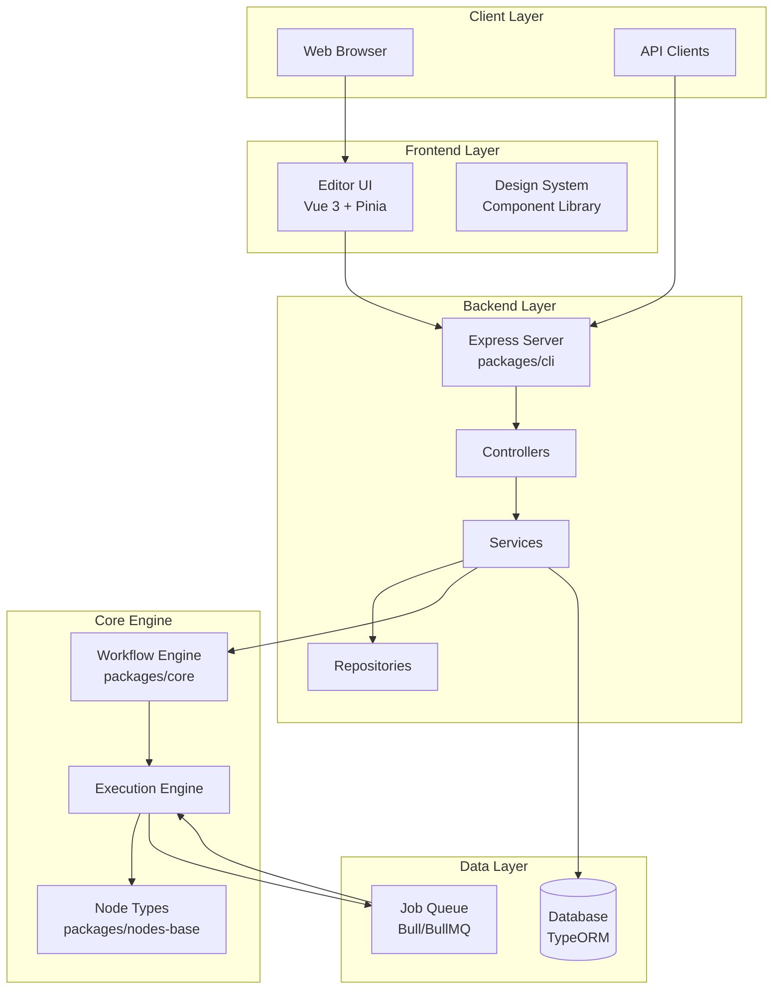
```mermaid
graph TB
    subgraph "Client Layer"
        Browser[Web Browser]
        API_Client[API Clients]
    end

    subgraph "Frontend Layer"
        EditorUI[Editor UI<br/>Vue 3 + Pinia]
        DesignSystem[Design System<br/>Component Library]
    end

    subgraph "Backend Layer"
        Server[Express Server<br/>packages/cli]
        Controllers[Controllers]
        Services[Services]
        Repositories[Repositories]
    end

    subgraph "Core Engine"
        WorkflowEngine[Workflow Engine<br/>packages/core]
        NodeTypes[Node Types<br/>packages/nodes-base]
        ExecutionEngine[Execution Engine]
    end

    subgraph "Data Layer"
        Database[(Database<br/>TypeORM)]
        Queue[Job Queue<br/>Bull/BullMQ]
    end

    Browser --> EditorUI
    API_Client --> Server
    EditorUI --> Server
    Server --> Controllers
    Controllers --> Services
    Services --> Repositories
    Services --> WorkflowEngine
    WorkflowEngine --> ExecutionEngine
    ExecutionEngine --> NodeTypes
    Services --> Database
    ExecutionEngine --> Queue
    Queue --> ExecutionEngine
```

## Monorepo Structure

The repository uses pnpm workspaces with Turbo for build orchestration. Packages are organized by domain and responsibility.

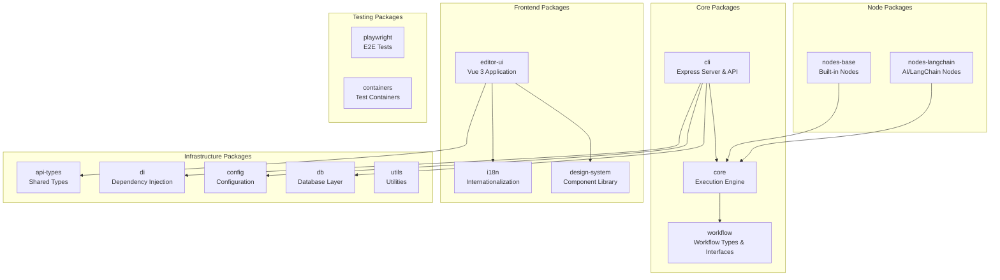
```mermaid
graph TD
    subgraph "Core Packages"
        Workflow[workflow<br/>Workflow Types & Interfaces]
        Core[core<br/>Execution Engine]
        CLI[cli<br/>Express Server & API]
    end

    subgraph "Frontend Packages"
        EditorUI[editor-ui<br/>Vue 3 Application]
        DesignSystem[design-system<br/>Component Library]
        I18n[i18n<br/>Internationalization]
    end

    subgraph "Node Packages"
        NodesBase[nodes-base<br/>Built-in Nodes]
        NodesLangchain[nodes-langchain<br/>AI/LangChain Nodes]
    end

    subgraph "Infrastructure Packages"
        DB[db<br/>Database Layer]
        Config[config<br/>Configuration]
        DI[di<br/>Dependency Injection]
        APITypes[api-types<br/>Shared Types]
        Utils[utils<br/>Utilities]
    end

    subgraph "Testing Packages"
        Playwright[playwright<br/>E2E Tests]
        Containers[containers<br/>Test Containers]
    end

    Core --> Workflow
    CLI --> Core
    CLI --> DB
    CLI --> Config
    CLI --> DI

    EditorUI --> DesignSystem
    EditorUI --> I18n
    EditorUI --> APITypes

    NodesBase --> Core
    NodesLangchain --> Core
```

## Package Dependencies

The dependency graph shows how packages relate to each other:

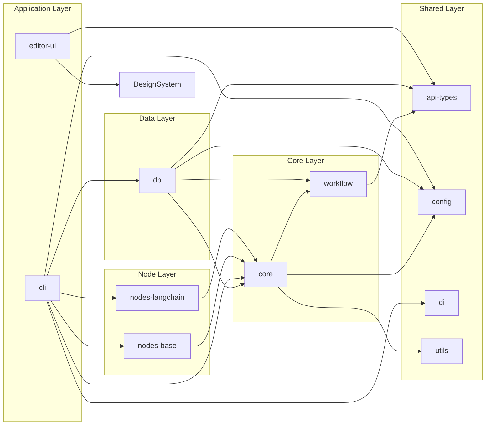
```mermaid
graph LR
    subgraph "Shared Layer"
        APITypes[api-types]
        Config[config]
        DI[di]
        Utils[utils]
    end

    subgraph "Core Layer"
        Workflow[workflow]
        Core[core]
    end

    subgraph "Data Layer"
        DB[db]
    end

    subgraph "Application Layer"
        CLI[cli]
        EditorUI[editor-ui]
    end

    subgraph "Node Layer"
        NodesBase[nodes-base]
        NodesLangchain[nodes-langchain]
    end

    Workflow --> APITypes
    Core --> Workflow
    Core --> Config
    Core --> Utils
    DB --> APITypes
    DB --> Config
    DB --> Core
    DB --> Workflow
    CLI --> Core
    CLI --> DB
    CLI --> Config
    CLI --> DI
    CLI --> NodesBase
    CLI --> NodesLangchain
    EditorUI --> APITypes
    EditorUI --> DesignSystem
    NodesBase --> Core
    NodesLangchain --> Core
```

## Backend Architecture

The backend follows a modular architecture with dependency injection, controller-service-repository pattern, and event-driven communication.

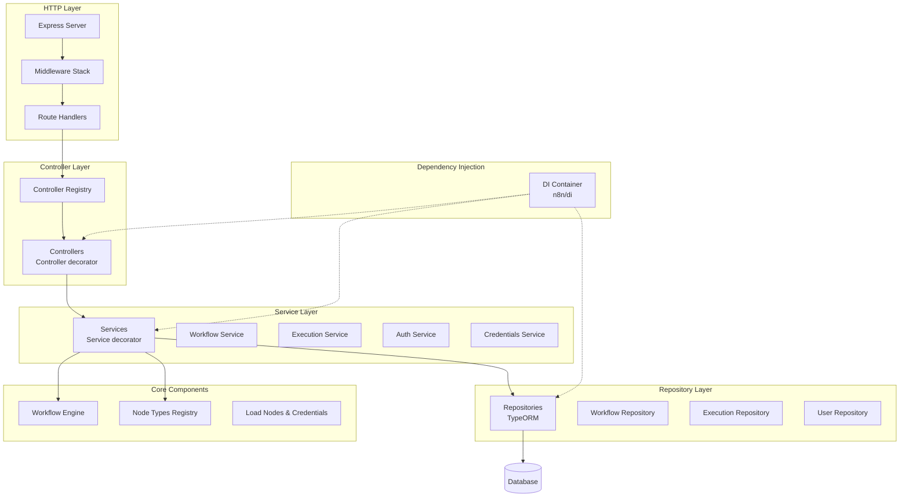
```mermaid
graph TB
    subgraph "HTTP Layer"
        Express[Express Server]
        Middleware[Middleware Stack]
        Routes[Route Handlers]
    end

    subgraph "Controller Layer"
        Controllers[Controllers<br/>Controller decorator]
        ControllerRegistry[Controller Registry]
    end

    subgraph "Service Layer"
        Services[Services<br/>Service decorator]
        WorkflowService[Workflow Service]
        ExecutionService[Execution Service]
        AuthService[Auth Service]
        CredentialsService[Credentials Service]
    end

    subgraph "Repository Layer"
        Repositories[Repositories<br/>TypeORM]
        WorkflowRepo[Workflow Repository]
        ExecutionRepo[Execution Repository]
        UserRepo[User Repository]
    end

    subgraph "Core Components"
        WorkflowEngine[Workflow Engine]
        NodeTypes[Node Types Registry]
        LoadNodes[Load Nodes & Credentials]
    end

    subgraph "Dependency Injection"
        Container[DI Container<br/>n8n/di]
    end

    Express --> Middleware
    Middleware --> Routes
    Routes --> ControllerRegistry
    ControllerRegistry --> Controllers
    Controllers --> Services
    Services --> Repositories
    Services --> WorkflowEngine
    Services --> NodeTypes
    Container -.-> Services
    Container -.-> Controllers
    Container -.-> Repositories
    Repositories --> Database[(Database)]
```

### Backend Module Structure

Backend modules follow a consistent structure:

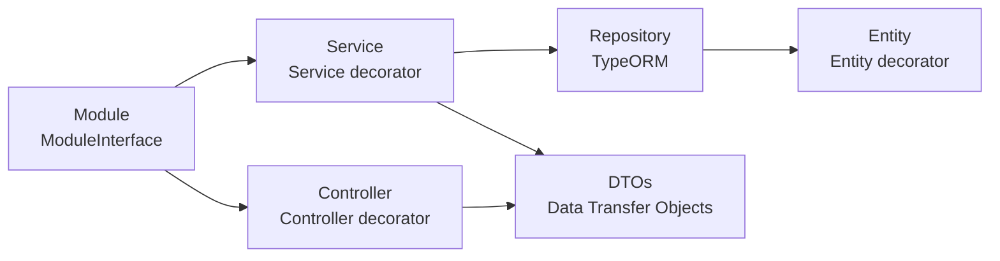
```mermaid
graph LR
    Module[Module<br/>ModuleInterface]
    Controller[Controller<br/>Controller decorator]
    Service[Service<br/>Service decorator]
    Repository[Repository<br/>TypeORM]
    Entity[Entity<br/>Entity decorator]
    DTO[DTOs<br/>Data Transfer Objects]

    Module --> Controller
    Module --> Service
    Service --> Repository
    Repository --> Entity
    Controller --> DTO
    Service --> DTO
```

## Frontend Architecture

The frontend is built with Vue 3, using Pinia for state management and a centralized design system for UI consistency.

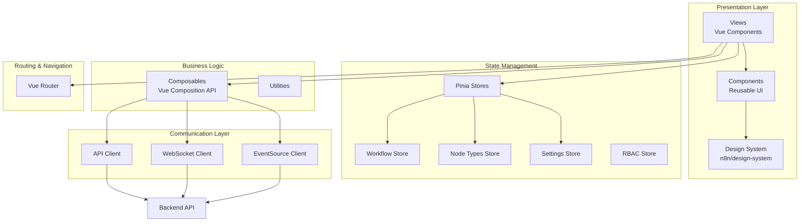
```mermaid
graph TB
    subgraph "Presentation Layer"
        Views[Views<br/>Vue Components]
        Components[Components<br/>Reusable UI]
        DesignSystem[Design System<br/>n8n/design-system]
    end

    subgraph "State Management"
        Pinia[Pinia Stores]
        WorkflowStore[Workflow Store]
        NodeTypesStore[Node Types Store]
        SettingsStore[Settings Store]
        RBACStore[RBAC Store]
    end

    subgraph "Business Logic"
        Composables[Composables<br/>Vue Composition API]
        Utils[Utilities]
    end

    subgraph "Communication Layer"
        API[API Client]
        WebSocket[WebSocket Client]
        EventSource[EventSource Client]
    end

    subgraph "Routing & Navigation"
        Router[Vue Router]
    end

    Views --> Components
    Components --> DesignSystem
    Views --> Pinia
    Pinia --> WorkflowStore
    Pinia --> NodeTypesStore
    Pinia --> SettingsStore
    Views --> Composables
    Composables --> API
    Composables --> WebSocket
    Composables --> EventSource
    API --> Backend[Backend API]
    WebSocket --> Backend
    EventSource --> Backend
    Views --> Router
```

### Frontend Feature Organization

Features are organized by domain:

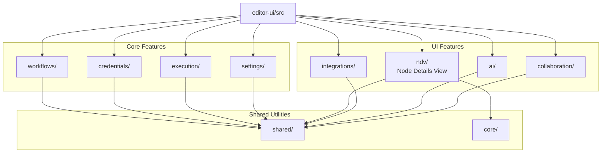
```mermaid
graph TD
    EditorUI[editor-ui/src]

    subgraph "Core Features"
        Workflows[workflows/]
        Credentials[credentials/]
        Execution[execution/]
        Settings[settings/]
    end

    subgraph "UI Features"
        NDV[ndv/<br/>Node Details View]
        Integrations[integrations/]
        AI[ai/]
        Collaboration[collaboration/]
    end

    subgraph "Shared Utilities"
        Shared[shared/]
        Core[core/]
    end

    EditorUI --> Workflows
    EditorUI --> Credentials
    EditorUI --> Execution
    EditorUI --> Settings
    EditorUI --> NDV
    EditorUI --> Integrations
    EditorUI --> AI
    EditorUI --> Collaboration

    Workflows --> Shared
    Credentials --> Shared
    Execution --> Shared
    Settings --> Shared
    NDV --> Core
    NDV --> Shared
    Integrations --> Shared
    AI --> Shared
    Collaboration --> Shared
```

## Workflow Execution Flow

Workflows are executed through a multi-stage process involving validation, execution, and result handling.

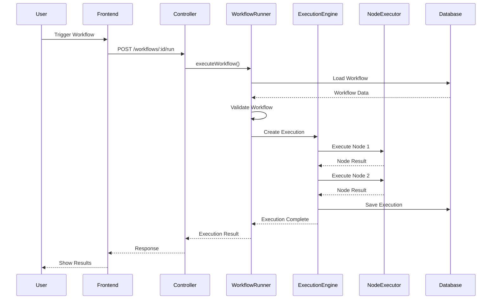
```mermaid
sequenceDiagram
    participant User
    participant Frontend
    participant Controller
    participant WorkflowRunner
    participant ExecutionEngine
    participant NodeExecutor
    participant Database

    User->>Frontend: Trigger Workflow
    Frontend->>Controller: POST /workflows/:id/run
    Controller->>WorkflowRunner: executeWorkflow()
    WorkflowRunner->>Database: Load Workflow
    Database-->>WorkflowRunner: Workflow Data
    WorkflowRunner->>WorkflowRunner: Validate Workflow
    WorkflowRunner->>ExecutionEngine: Create Execution
    ExecutionEngine->>NodeExecutor: Execute Node 1
    NodeExecutor-->>ExecutionEngine: Node Result
    ExecutionEngine->>NodeExecutor: Execute Node 2
    NodeExecutor-->>ExecutionEngine: Node Result
    ExecutionEngine->>Database: Save Execution
    ExecutionEngine-->>WorkflowRunner: Execution Complete
    WorkflowRunner-->>Controller: Execution Result
    Controller-->>Frontend: Response
    Frontend-->>User: Show Results
```

### Execution Contexts

Different execution contexts handle various workflow execution modes:

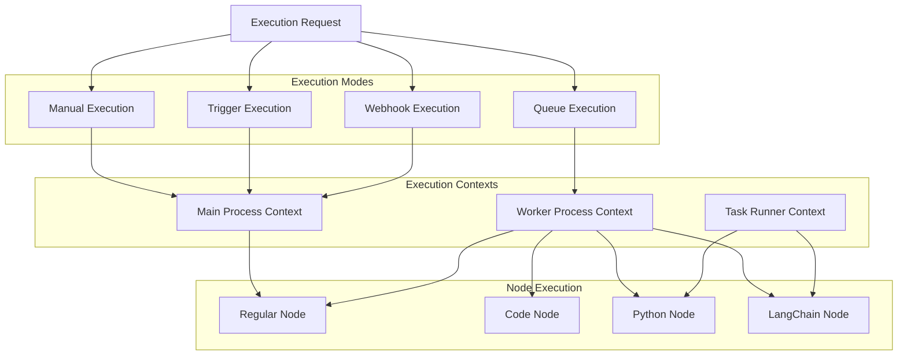
```mermaid
graph TB
    ExecutionRequest[Execution Request]

    subgraph "Execution Modes"
        Manual[Manual Execution]
        Trigger[Trigger Execution]
        Webhook[Webhook Execution]
        Queue[Queue Execution]
    end

    subgraph "Execution Contexts"
        MainContext[Main Process Context]
        WorkerContext[Worker Process Context]
        TaskRunnerContext[Task Runner Context]
    end

    subgraph "Node Execution"
        RegularNode[Regular Node]
        CodeNode[Code Node]
        PythonNode[Python Node]
        LangChainNode[LangChain Node]
    end

    ExecutionRequest --> Manual
    ExecutionRequest --> Trigger
    ExecutionRequest --> Webhook
    ExecutionRequest --> Queue

    Manual --> MainContext
    Trigger --> MainContext
    Webhook --> MainContext
    Queue --> WorkerContext

    MainContext --> RegularNode
    WorkerContext --> RegularNode
    WorkerContext --> CodeNode
    WorkerContext --> PythonNode
    WorkerContext --> LangChainNode
    TaskRunnerContext --> PythonNode
    TaskRunnerContext --> LangChainNode
```

## Database Layer

The database layer uses TypeORM with support for multiple database backends. It follows a repository pattern with entities and migrations.

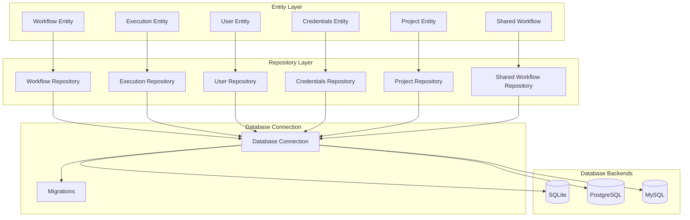
```mermaid
graph TB
    subgraph "Entity Layer"
        WorkflowEntity[Workflow Entity]
        ExecutionEntity[Execution Entity]
        UserEntity[User Entity]
        CredentialsEntity[Credentials Entity]
        ProjectEntity[Project Entity]
        SharedWorkflow[Shared Workflow]
    end

    subgraph "Repository Layer"
        WorkflowRepo[Workflow Repository]
        ExecutionRepo[Execution Repository]
        UserRepo[User Repository]
        CredentialsRepo[Credentials Repository]
        ProjectRepo[Project Repository]
        SharedWorkflowRepo[Shared Workflow Repository]
    end

    subgraph "Database Connection"
        DBConnection[Database Connection]
        Migrations[Migrations]
    end

    subgraph "Database Backends"
        SQLite[(SQLite)]
        PostgreSQL[(PostgreSQL)]
        MySQL[(MySQL)]
    end

    WorkflowEntity --> WorkflowRepo
    ExecutionEntity --> ExecutionRepo
    UserEntity --> UserRepo
    CredentialsEntity --> CredentialsRepo
    ProjectEntity --> ProjectRepo
    SharedWorkflow --> SharedWorkflowRepo

    WorkflowRepo --> DBConnection
    ExecutionRepo --> DBConnection
    UserRepo --> DBConnection
    CredentialsRepo --> DBConnection
    ProjectRepo --> DBConnection
    SharedWorkflowRepo --> DBConnection

    DBConnection --> Migrations
    DBConnection --> SQLite
    DBConnection --> PostgreSQL
    DBConnection --> MySQL
```

### Entity Relationships

Key entity relationships in the database:

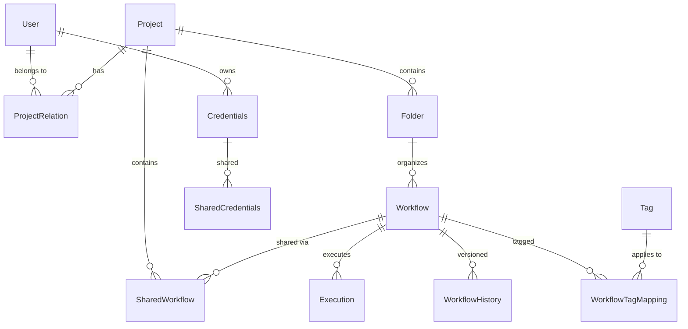
```mermaid
erDiagram
    User ||--o{ ProjectRelation : "belongs to"
    Project ||--o{ ProjectRelation : "has"
    Project ||--o{ SharedWorkflow : "contains"
    Workflow ||--o{ SharedWorkflow : "shared via"
    Workflow ||--o{ Execution : "executes"
    Workflow ||--o{ WorkflowHistory : "versioned"
    User ||--o{ Credentials : "owns"
    Credentials ||--o{ SharedCredentials : "shared"
    Workflow ||--o{ WorkflowTagMapping : "tagged"
    Tag ||--o{ WorkflowTagMapping : "applies to"
    Folder ||--o{ Workflow : "organizes"
    Project ||--o{ Folder : "contains"
```

## Scaling & Queue System

n8n supports horizontal scaling through a queue-based system using Bull/BullMQ for job processing.

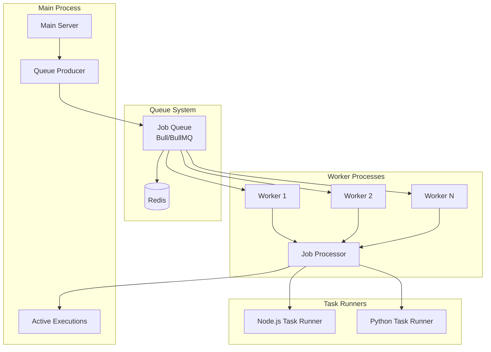
```mermaid
graph TB
    subgraph "Main Process"
        MainServer[Main Server]
        QueueProducer[Queue Producer]
        ActiveExecutions[Active Executions]
    end

    subgraph "Queue System"
        JobQueue[Job Queue<br/>Bull/BullMQ]
        Redis[(Redis)]
    end

    subgraph "Worker Processes"
        Worker1[Worker 1]
        Worker2[Worker 2]
        WorkerN[Worker N]
        JobProcessor[Job Processor]
    end

    subgraph "Task Runners"
        TaskRunnerJS[Node.js Task Runner]
        TaskRunnerPython[Python Task Runner]
    end

    MainServer --> QueueProducer
    QueueProducer --> JobQueue
    JobQueue --> Redis
    JobQueue --> Worker1
    JobQueue --> Worker2
    JobQueue --> WorkerN
    Worker1 --> JobProcessor
    Worker2 --> JobProcessor
    WorkerN --> JobProcessor
    JobProcessor --> TaskRunnerJS
    JobProcessor --> TaskRunnerPython
    JobProcessor --> ActiveExecutions
```

### Scaling Architecture

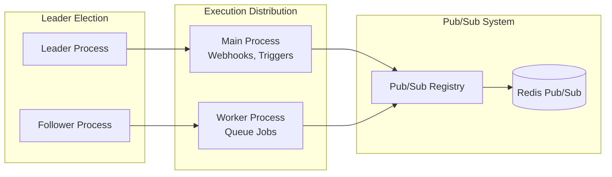
```mermaid
graph LR
    subgraph "Leader Election"
        Leader[Leader Process]
        Follower[Follower Process]
    end

    subgraph "Pub/Sub System"
        PubSub[Pub/Sub Registry]
        RedisPubSub[(Redis Pub/Sub)]
    end

    subgraph "Execution Distribution"
        MainProcess[Main Process<br/>Webhooks, Triggers]
        WorkerProcess[Worker Process<br/>Queue Jobs]
    end

    Leader --> MainProcess
    Follower --> WorkerProcess
    MainProcess --> PubSub
    WorkerProcess --> PubSub
    PubSub --> RedisPubSub
```

## Module System

Backend modules are self-contained units that can be enabled/disabled. They follow a consistent interface.

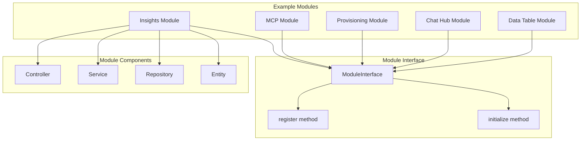
```mermaid
graph TB
    subgraph "Module Interface"
        ModuleInterface[ModuleInterface]
        Register[register method]
        Initialize[initialize method]
    end

    subgraph "Example Modules"
        InsightsModule[Insights Module]
        MCPModule[MCP Module]
        ProvisioningModule[Provisioning Module]
        ChatHubModule[Chat Hub Module]
        DataTableModule[Data Table Module]
    end

    subgraph "Module Components"
        ModuleController[Controller]
        ModuleService[Service]
        ModuleRepository[Repository]
        ModuleEntity[Entity]
    end

    ModuleInterface --> Register
    ModuleInterface --> Initialize

    InsightsModule --> ModuleInterface
    MCPModule --> ModuleInterface
    ProvisioningModule --> ModuleInterface
    ChatHubModule --> ModuleInterface
    DataTableModule --> ModuleInterface

    InsightsModule --> ModuleController
    InsightsModule --> ModuleService
    InsightsModule --> ModuleRepository
    InsightsModule --> ModuleEntity
```

## Node System

Nodes are the building blocks of workflows. They can be regular nodes, code nodes, or specialized nodes like LangChain nodes.

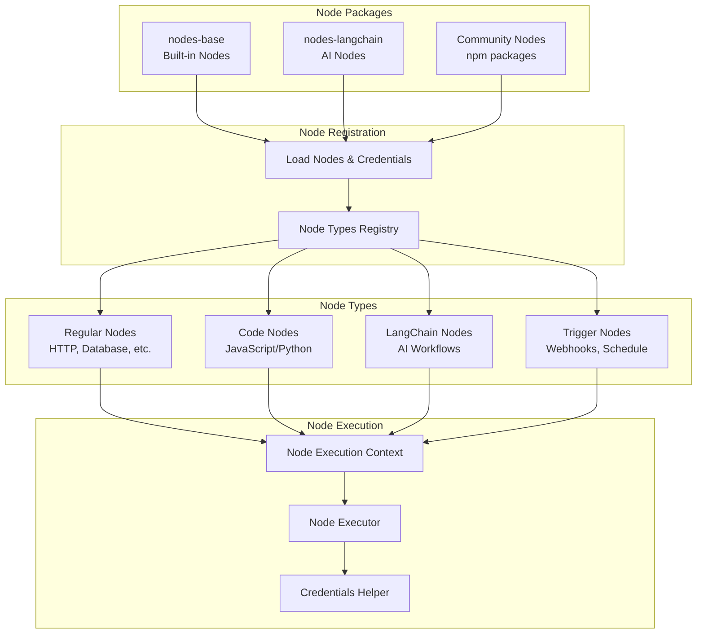
```mermaid
graph TB
    subgraph "Node Registration"
        LoadNodes[Load Nodes & Credentials]
        NodeTypesRegistry[Node Types Registry]
    end

    subgraph "Node Types"
        RegularNodes[Regular Nodes<br/>HTTP, Database, etc.]
        CodeNodes[Code Nodes<br/>JavaScript/Python]
        LangChainNodes[LangChain Nodes<br/>AI Workflows]
        TriggerNodes[Trigger Nodes<br/>Webhooks, Schedule]
    end

    subgraph "Node Execution"
        NodeContext[Node Execution Context]
        NodeExecutor[Node Executor]
        CredentialsHelper[Credentials Helper]
    end

    subgraph "Node Packages"
        NodesBase[nodes-base<br/>Built-in Nodes]
        NodesLangchain[nodes-langchain<br/>AI Nodes]
        CommunityNodes[Community Nodes<br/>npm packages]
    end

    LoadNodes --> NodeTypesRegistry
    NodeTypesRegistry --> RegularNodes
    NodeTypesRegistry --> CodeNodes
    NodeTypesRegistry --> LangChainNodes
    NodeTypesRegistry --> TriggerNodes

    RegularNodes --> NodeContext
    CodeNodes --> NodeContext
    LangChainNodes --> NodeContext
    TriggerNodes --> NodeContext

    NodeContext --> NodeExecutor
    NodeExecutor --> CredentialsHelper

    NodesBase --> LoadNodes
    NodesLangchain --> LoadNodes
    CommunityNodes --> LoadNodes
```

### Node Structure

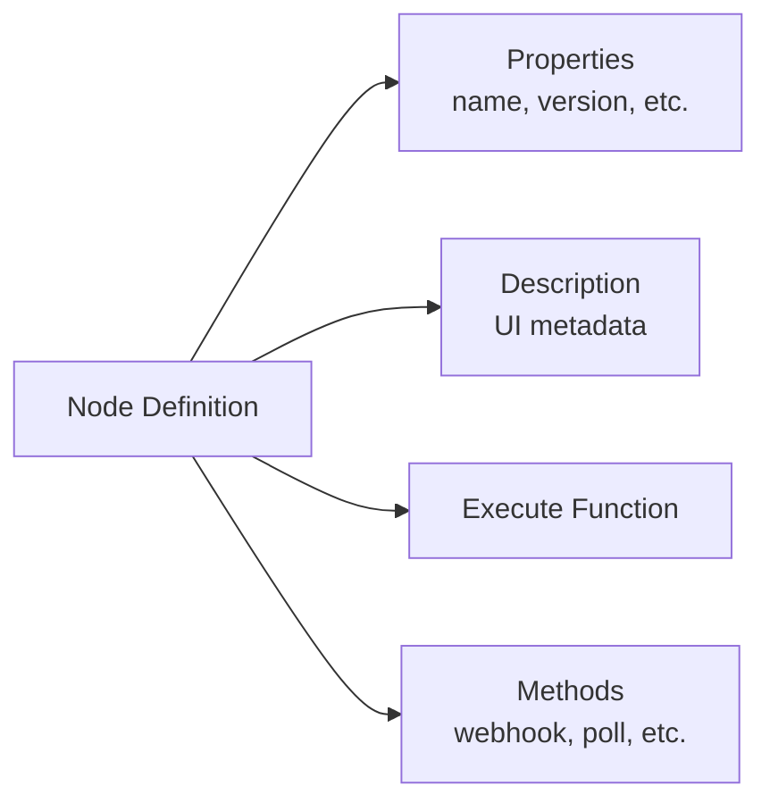
```mermaid
graph LR
    NodeDefinition[Node Definition]
    NodeProperties[Properties<br/>name, version, etc.]
    NodeDescription[Description<br/>UI metadata]
    NodeExecute[Execute Function]
    NodeMethods[Methods<br/>webhook, poll, etc.]

    NodeDefinition --> NodeProperties
    NodeDefinition --> NodeDescription
    NodeDefinition --> NodeExecute
    NodeDefinition --> NodeMethods
```

## Authentication & Authorization

n8n uses a role-based access control (RBAC) system with JWT authentication and permission scopes.

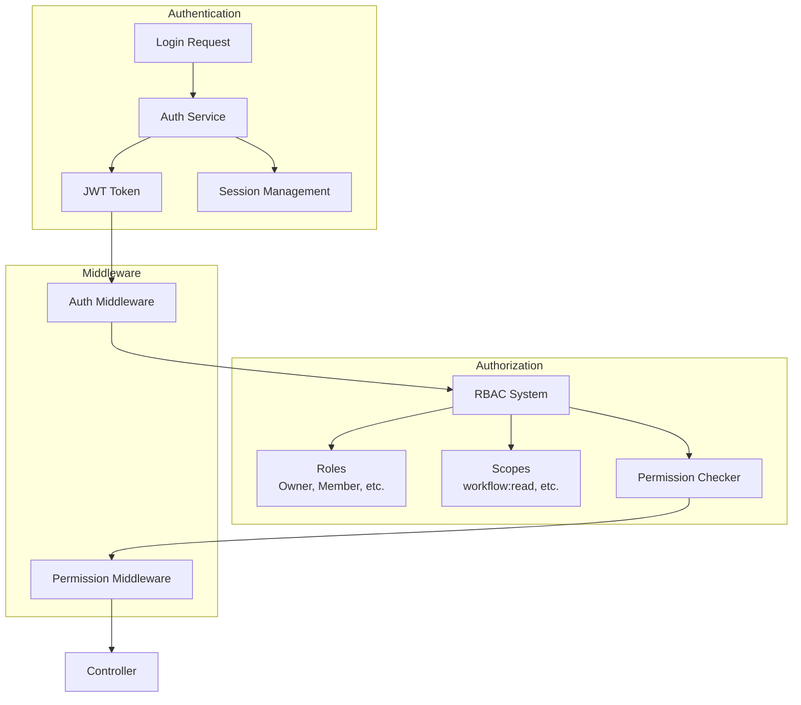
```mermaid
graph TB
    subgraph "Authentication"
        Login[Login Request]
        AuthService[Auth Service]
        JWT[JWT Token]
        Session[Session Management]
    end

    subgraph "Authorization"
        RBAC[RBAC System]
        Roles[Roles<br/>Owner, Member, etc.]
        Scopes[Scopes<br/>workflow:read, etc.]
        Permissions[Permission Checker]
    end

    subgraph "Middleware"
        AuthMiddleware[Auth Middleware]
        PermissionMiddleware[Permission Middleware]
    end

    Login --> AuthService
    AuthService --> JWT
    AuthService --> Session
    JWT --> AuthMiddleware
    AuthMiddleware --> RBAC
    RBAC --> Roles
    RBAC --> Scopes
    RBAC --> Permissions
    Permissions --> PermissionMiddleware
    PermissionMiddleware --> Controller
```

### Permission Model

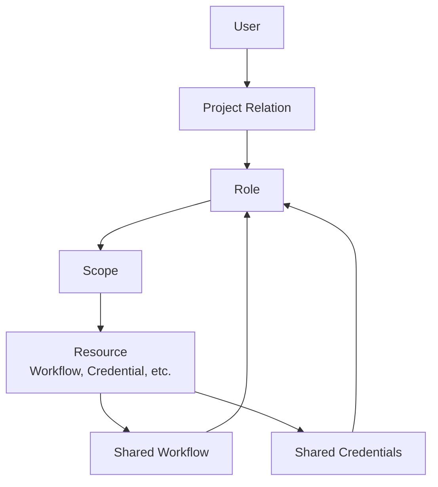
```mermaid
graph TD
    User[User]
    ProjectRelation[Project Relation]
    Role[Role]
    Scope[Scope]
    Resource[Resource<br/>Workflow, Credential, etc.]

    User --> ProjectRelation
    ProjectRelation --> Role
    Role --> Scope
    Scope --> Resource

    SharedWorkflow[Shared Workflow]
    SharedCredentials[Shared Credentials]

    Resource --> SharedWorkflow
    Resource --> SharedCredentials
    SharedWorkflow --> Role
    SharedCredentials --> Role
```

## Event System

n8n uses an event-driven architecture for decoupled communication between components.

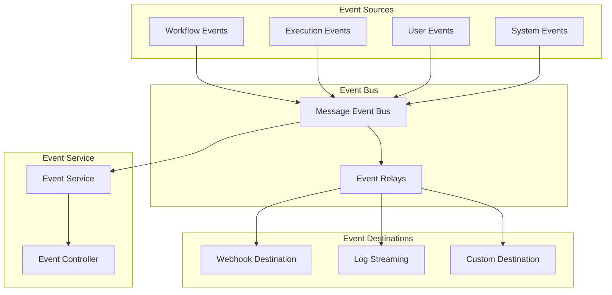
```mermaid
graph TB
    subgraph "Event Sources"
        WorkflowEvents[Workflow Events]
        ExecutionEvents[Execution Events]
        UserEvents[User Events]
        SystemEvents[System Events]
    end

    subgraph "Event Bus"
        MessageEventBus[Message Event Bus]
        EventRelays[Event Relays]
    end

    subgraph "Event Destinations"
        WebhookDestination[Webhook Destination]
        LogStreaming[Log Streaming]
        CustomDestination[Custom Destination]
    end

    subgraph "Event Service"
        EventService[Event Service]
        EventController[Event Controller]
    end

    WorkflowEvents --> MessageEventBus
    ExecutionEvents --> MessageEventBus
    UserEvents --> MessageEventBus
    SystemEvents --> MessageEventBus

    MessageEventBus --> EventRelays
    EventRelays --> WebhookDestination
    EventRelays --> LogStreaming
    EventRelays --> CustomDestination

    MessageEventBus --> EventService
    EventService --> EventController
```

## Configuration Management

Configuration is managed centrally through the `@n8n/config` package with environment variable support and validation.

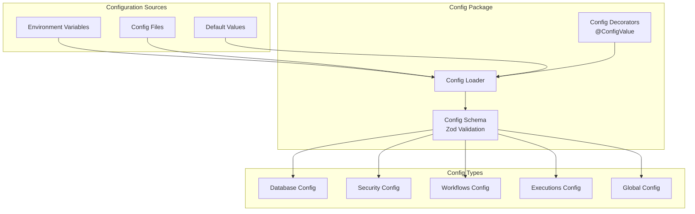
```mermaid
graph TB
    subgraph "Configuration Sources"
        EnvVars[Environment Variables]
        ConfigFiles[Config Files]
        Defaults[Default Values]
    end

    subgraph "Config Package"
        ConfigSchema[Config Schema<br/>Zod Validation]
        ConfigLoader[Config Loader]
        ConfigDecorators[Config Decorators<br/>@ConfigValue]
    end

    subgraph "Config Types"
        DatabaseConfig[Database Config]
        SecurityConfig[Security Config]
        WorkflowsConfig[Workflows Config]
        ExecutionsConfig[Executions Config]
        GlobalConfig[Global Config]
    end

    EnvVars --> ConfigLoader
    ConfigFiles --> ConfigLoader
    Defaults --> ConfigLoader

    ConfigLoader --> ConfigSchema
    ConfigSchema --> DatabaseConfig
    ConfigSchema --> SecurityConfig
    ConfigSchema --> WorkflowsConfig
    ConfigSchema --> ExecutionsConfig
    ConfigSchema --> GlobalConfig

    ConfigDecorators --> ConfigLoader
```
